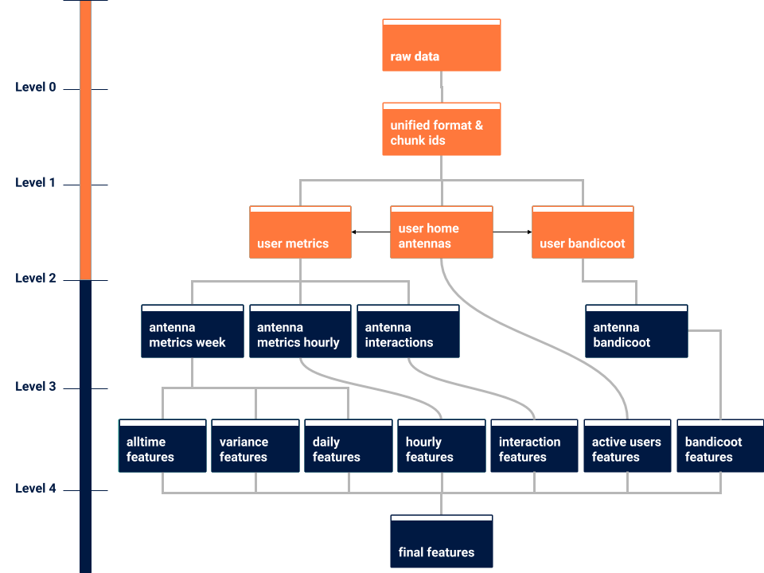

======
gnuper
======

**gnuper** is an open source python package for the preprocessing of mobile phone metadata whilst keeping privacy in mind. It is being developed by the spin-off project `knuper <https://www.knuper.com>`_ of the Freie Universität Berlin.
The package creates features on antenna level off of mobile phone metadata like simple incoming to outgoing ratios of calls or sms as well as entropy and isolation indicators of antennas. Additionally one can include antenna averages of the bandicoot individual indicators developed by the MIT. Further information on this toolkit can be found `here <http://bandicoot.mit.edu/>`_.

Prerequisites
-------------
- Python3
- Apache Spark

Structural Overview
-------------------

- **Level 0**
- **Level 1**
- **Level 2**
- **Level 3**
- **Level 4**

Sample Data
-----------
In order to create a small synthetic CDR sample data set (~20MB) run the ipython
script `cdr_mockup.ipynb <cdr_mockup.ipynb>`_ e.g. with Jupyter.

Spark
-----
The package has been built using SPARK version 2.2.1.

Instructions on how to install Spark in Ubuntu (tested with 18.04):

1. install java environment ``sudo apt-get install default-jre``
2. install scala ``sudo apt-get install scala``
3. download spark
   ``wget http://archive.apache.org/dist/spark/spark-2.2.1/spark-2.2.1-bin-hadoop2.7.tgz``
4. unzip ``sudo tar -zxvf spark-2.2.1-bin-hadoop2.7.tgz``
5. and remove ``rm spark-2.2.1-bin-hadoop2.7.tgz``
